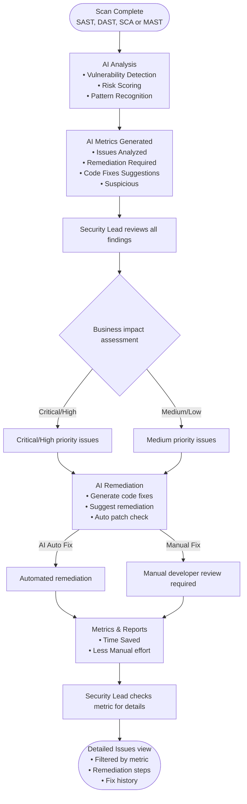

# SAST Case Study — Source of Truth

> Status: **structured — ready to build.** This is the single source of truth for the AI-powered SAST remediation case study. Everything on the public page must trace back to this file or the resume. Build the page in the section order below and follow the **Build guidance** at the end.

## Snapshot

- **Project:** AI-powered vulnerability remediation — an add-on to the core Application Security (SAST) product
- **One-liner:** Redesigned an AI-powered SAST platform to kill alert fatigue, pull developers into the security workflow, and turn a compliance checkbox into a team superpower.
- **My role:** Lead UX Designer — owned UX end to end (ideation → research → flows → design → accessibility/usability validation → GA)
- **Duration:** 6 months
- **Team:** BU Head, 2 PMs, 6 Engineers
- **Platforms:** Web app + IDE plugins
- **Origin:** Co-created with the PM; won **2nd place** at an internal Hackathon → business approval → shipped to selected customers
- **Scope tags:** SAST, DAST, SCA, MAST — Enterprise SaaS, AI-driven UX

## How to use this file

- Sections 1–9 are the case-study arc, in order. Build the page in this sequence.
- The **Build guidance** section (bottom) has page structure, tone, and what to emphasize for recruiters.
- Check every number against **NDA & metrics safety** before it goes public.

## NDA & metrics safety (read before publishing anything)

- All OpenText cybersecurity product work is **NDA-protected**. No real product screenshots, customer names (beyond OpenText / the BU), or feature-level internals unless explicitly cleared.
- Use the abstracted persona ("Sarah Chen / TechCorp") and generic UI — never real customer data.
- Metric provenance — publish only what the **Publish?** column allows:

| Metric | Value | Source | Publish? |
| ------ | ----- | ------ | -------- |
| Support tickets | ↓ 20% | Resume (public) | ✅ Yes |
| Task completion | ↑ 35% | Resume (public) | ✅ Yes |
| Hackathon result | 2nd place | Internal event (no client data) | ✅ Yes |
| False positives (baseline) | 52% of findings | Project baseline | ⚠️ Confirm NDA-safe |
| Manual audit time (baseline) | 18 min/finding × 400+/sprint | Project baseline | ⚠️ Confirm NDA-safe |
| Developer engagement (baseline) | 23% checked results | Project baseline | ⚠️ Confirm NDA-safe |
| MTTR 45→18d, 847 hrs / $66k, 39x ROI, 247/89/34, 75/80/90% | various | Persona / concept narrative | ❌ Illustrative only — never present as shipped results |

---

## 1. Overview / summary
<!-- One-paragraph what-this-was. The elevator version. -->

How I redesigned an AI-powered static application security testing (SAST) platform to eliminate alert fatigue, bring developers into the security workflow, and turn a compliance checkbox into a team superpower.

**At a glance**
- *Duration:* 6 months
- *Team:* BU Head, 2 PMs, 6 Engineers
- *Available in:* Web app, IDE plugins
- *Product model:* Add-on service for the core application security product

## 2. Role & context
<!-- Your role, team, timeframe, who you worked with, what you owned vs. influenced. -->

**Origin story**
The idea started informally during the wave of AI buzz — the PM and I were kicking around a thought: we already do vulnerability assessment, so why can't we leverage AI to *remediate* automatically after each scan? We played with competitor tools at the time and found even they were behind on this capability.

We built out full use cases and an end-to-end visual task flow and submitted it as a **Hackathon idea** — the panel liked it and awarded it **2nd place**. That earned business approval to take the feature forward and test it with a set of selected customers, positioned as an **add-on service to the core product**. During ideation we gathered additional use cases from internal stakeholders, implemented the feature, and delivered it to those early customers. Before GA we ran thorough **accessibility, usability, and heuristic evaluation** and folded the resulting changes into the GA build. Feedback from stakeholders and customers was strongly positive.

## 3. Problem
<!-- The real friction. Who was hurting, what was slow/confusing, why it mattered in a security context. -->

**Core problem (shared by PM):**

Organizations face an exponential growth in application security vulnerabilities while operating with constrained security resources. Traditional vulnerability management approaches rely heavily on manual processes that cannot scale with modern development velocities and application portfolios. Security teams spend 60-70% of their time on manual vulnerability triage and analysis, leading to delayed remediation, team burnout, and increased business risk.

**Quantified pain (baseline):**
- 52% of all findings were false positives → severe alert fatigue
- 18 min average to manually audit one finding × 400+ findings per sprint
- Only 23% of developers ever checked security results; the rest ignored them

**Frustrations solved:**
- False positives
- Slow scans
- Poor developer UX
- No fix guidance
- Hard prioritization

## 4. Constraints & considerations
<!-- Technical, org, compliance (WCAG), timeline, NDA limits, stakeholder pressures. -->

- **NDA:** can't show real product UI, customer data, or model internals publicly (see NDA & metrics safety).
- **Trust bar for AI:** an AI "auto-fix" in security tooling has near-zero tolerance for error — every automated action needs a human-review path and an audit trail. AI had to be *assistive with oversight*, not autonomous.
- **Two audiences, one product:** security leads (triage, oversight, reporting) and developers (in-IDE fixes) work in opposite contexts — the design had to serve both without compromise.
- **Compliance:** enterprise security context → WCAG 2.1 accessibility required; audit frameworks (SOC 2, PCI DSS, GDPR) shaped the reporting/evidence needs.
- **Add-on model:** had to layer onto the existing core product without disrupting current workflows.
- **Timeline:** ~6 months from approved idea to GA; accessibility, usability, and heuristic evaluation gated the GA build.

## 5. Research & insights
<!-- What you learned. Interviews, usability findings, data, support-ticket themes. -->

**Primary persona / user story — Sarah Chen, Senior Security Lead at TechCorp:**

> "Every morning, I start my day knowing that our AI-powered vulnerability management system has been working overnight, analyzing the results from our continuous security scans across 47 different applications in our portfolio. What once took my team 3-4 hours of manual analysis now happens automatically, with AI providing risk-based prioritization that considers not just CVSS scores, but actual business impact and exploitability in our specific environment.
>
> The transformation has been remarkable. Previously, we struggled with alert fatigue and false positives that consumed 70% of our time. Now, AI filters out the noise and presents me with actionable intelligence. When I click on any of our key metrics—247 issues analyzed, 89 requiring remediation, 34 with automated code fixes available—I'm immediately taken to filtered views showing exactly which vulnerabilities need attention and why.
>
> What motivates me most is seeing how this system has improved our relationship with development teams. Instead of being seen as a roadblock, security has become an enabler. Developers receive specific, actionable fix suggestions directly in their IDEs, with context about why the vulnerability matters and step-by-step remediation guidance. Our Mean Time to Remediation has dropped from 45 days to 18 days, and developer satisfaction with security processes has increased dramatically.
>
> The executive reporting capabilities have been game-changing for securing resources and demonstrating value. When I present our quarterly security review, I can show concrete ROI metrics: time saved, vulnerabilities prevented, and business risk reduced. The system tracks that we've saved 847 hours of manual effort this quarter alone, translating to \$66,000 in operational cost savings while improving our security posture.
>
> My biggest challenge used to be coordinating between my security team and eight different development teams across our organization. Now, the AI system provides a unified view of security across all applications, with automated workflows that ensure nothing falls through the cracks. It's transformed security from a reactive, manual process to a proactive, intelligence-driven operation."

Signals to design against (extracted from the story):
- Portfolio scale: ~47 applications; coordination across 8 dev teams.
- Overnight/automated analysis replaces 3-4 hrs/day manual triage.
- Prioritization must go beyond CVSS → business impact + exploitability in context.
- Alert fatigue / false positives consumed ~70% of time → noise filtering is core.
- Key dashboard metrics act as entry points → clicking drills into filtered views.
- Fixes delivered in-IDE with context + step-by-step guidance.
- Executive/quarterly reporting with ROI (time saved, cost saved, risk reduced).

### Persona profile — Sarah Chen, Senior Security Lead

**Demographics & background**
- Age 35; MS in Cybersecurity; CISSP, CISM certified
- 8+ years in cybersecurity, 3+ years in leadership
- Manages a 6-person security team
- Mid-size technology company with 47 applications

**Role & responsibilities**
Primary security lead for application security across the portfolio. Owns vulnerability management, security policy development, tool oversight, and compliance. Coordinates across eight development teams while maintaining relationships with executive leadership and external auditors.

**Daily workflow**
Reviews overnight scan results, prioritizes remediation by business risk, coordinates fixes with dev teams, and generates stakeholder reports. Time split: 30% vulnerability management, 25% team coordination, 20% compliance, 15% tool management, 10% strategic planning.

**Goals & motivations**
- Primary: reduce application security risk; improve remediation efficiency
- Secondary: demonstrate ROI of security investments; boost team productivity
- Personal: protect company assets, advance her career, build efficient processes, mentor her team

**Pain points & frustrations**
- Manual triage consumes excessive time and delays critical remediation
- False positives waste resources and create alert fatigue
- Limited visibility into remediation progress across multiple dev teams
- Developers don't always prioritize security fixes appropriately
- Executives question security spend without clear ROI metrics
- Security tools don't integrate well with development workflows

**Tools & technology**
Veracode, Checkmarx, ServiceNow, Jira, Splunk, AWS Security Hub. Slack for team comms, email for exec updates, video calls for complex technical discussions. Expert vulnerability assessment, strong NIST/OWASP knowledge, security automation scripting.

**Success metrics (her definition)**
- Mean Time to Remediation under 30 days
- Vulnerability closure rate above 85%
- Zero critical security incidents
- Team productivity improvements
- Positive audit results and compliance maintenance

## 6. Process
<!-- How you worked: flows, IA, prototyping, iterations, critiques, handoff. -->

### Task flow — AI-powered vulnerability remediation (end to end)

Comprehensive transformation from traditional manual processes to intelligent, automated workflows. The flow begins when vulnerability scans complete and extends through final remediation and reporting.

1. **Initial scan completion** — SAST, DAST, SCA, and MAST scans complete across the portfolio. Scans run continuously, feeding fresh vulnerability data into the AI analysis engine. The system normalizes data formats from multiple tools and de-duplicates to create a unified vulnerability dataset.

2. **AI analysis phase** — The engine processes results with ML to identify patterns, assess risk scores, and auto-classify. It weighs CVSS scores, business context, asset criticality, and historical exploit patterns to generate prioritization recommendations.
   - *Pattern recognition:* suspicious behaviors and potential attack vectors across apps
   - *Risk scoring:* contextual risk from business impact + exploitability
   - *False-positive reduction:* filters low-confidence findings to cut alert fatigue

3. **Security lead review & decision points** — Sarah gets AI-generated findings on her dashboard as actionable intelligence (not raw scan data), enabling faster decisions and resource allocation.
   - *Business impact assessment:* vulnerabilities weighed against business-critical apps/processes
   - *Resource allocation:* remediation tasks assigned by team capacity and expertise
   - *Risk acceptance:* immediate attention vs. acceptable risk levels

4. **AI-powered remediation** — Once priorities are set, the remediation engine generates specific code-fix suggestions and implementation guidance, drawing on databases of security patterns and successful fixes that slot into existing workflows.
   - *Automated code fixes:* AI-generated patches for common vulnerability patterns
   - *Manual review:* guided remediation for complex issues needing human expertise
   - *Progress tracking:* real-time monitoring of implementation and validation

5. **Metrics & ROI tracking** — Continuously tracks issues analyzed, vulnerabilities remediated, time saved, and overall ROI as evidence of effectiveness and budget justification. Interactive dashboards let Sarah click a metric to drill into filtered views (status, remediation history, implementation details).

6. **Continuous improvement loop** — Concludes with automated validation of remediation effectiveness and ongoing monitoring for new vulnerabilities. Maintains audit trails for compliance while feeding learnings back into the AI engine to improve future analysis and recommendations.

Net: transforms vulnerability management from a reactive, labor-intensive process into a proactive, intelligence-driven operation that scales with modern development while maintaining rigorous security standards.

### Task flow diagram (transcribed from FigJam board)

> Source: FigJam "Task Flow chat" board (screenshot on hand). Two decision branches: business-impact severity (Critical/High vs Medium/Low) and remediation path (AI auto-fix vs manual developer review); both branches rejoin before metrics/reporting. Save the board export to `src/assets/` and log it in the Assets table when ready.

## 7. Solution
<!-- What shipped. Key decisions and why. Describe without NDA-breaking specifics. -->

### Use cases

**Use Case 1 — Post-scan AI analysis and prioritization**
- *Primary persona:* Security Lead
- *Secondary personas:* AI Analysis Engine, Development Team
- *Flow:* Begins when vulnerability scans complete across the portfolio. The AI engine automatically processes SAST/DAST/SCA/MAST results and generates risk-based prioritization in minutes rather than hours of manual analysis. The Security Lead reviews AI-generated insights, weighs business impact, and assigns remediation tasks to the right teams.
- *Success scenario:* AI analyzes 247 vulnerabilities, flags 89 needing immediate remediation, and delivers context-aware prioritization that cuts manual triage time by 75%. False-positive rate drops below 10% via ML pattern recognition.

**Use Case 2 — AI-assisted code remediation**
- *Primary persona:* Security Lead
- *Secondary personas:* Developers
- *Flow:* Following prioritization, the AI remediation engine generates specific code-fix suggestions for identified vulnerabilities, leveraging extensive code-pattern databases and security best practices for actionable guidance. The Security Lead reviews AI recommendations, approves automated fixes where appropriate, and tracks implementation progress across development teams.
- *Success scenario:* AI generates code fixes for 34 critical vulnerabilities with an 80% auto-fix success rate, reducing Mean Time to Remediation by 60%. Developer adoption rises as fix suggestions integrate seamlessly into existing workflows.

**Use Case 3 — Executive vulnerability reporting**
- *Primary persona:* Security Lead
- *Secondary personas:* Executive Team, Compliance Officer
- *Flow:* The Security Lead generates comprehensive executive dashboards showing security program effectiveness and ROI. AI-powered analytics provide trend analysis, risk-reduction metrics, and business-value quantification, enabling data-driven security investment decisions and resource allocation planning.
- *Success scenario:* Executive visibility increases through real-time security KPIs, demonstrating 39x ROI from AI implementation and justifying continued security program funding.

**Use Case 4 — Developer workflow integration**
- *Primary persona:* Developer
- *Secondary personas:* Security Lead, AI Engine
- *Flow:* Developers receive vulnerability alerts directly in their IDEs, complete with AI-generated fix suggestions and implementation guidance. This eliminates context switching and reduces the friction traditionally associated with security remediation.
- *Success scenario:* Developer adoption rate exceeds 90% with security feedback response times under 2 hours, creating a seamless security-integrated development experience.

**Use Case 5 — Compliance and audit preparation**
- *Primary persona:* Security Lead
- *Secondary personas:* Auditors, Compliance Team
- *Flow:* The Security Lead leverages comprehensive vulnerability tracking and remediation evidence to streamline compliance reporting and audit prep. AI-generated audit trails provide complete remediation history and demonstrate continuous security monitoring.
- *Success scenario:* Audit preparation time drops 50% while maintaining 100% compliance coverage across frameworks including SOC 2, PCI DSS, and GDPR.

## 8. Outcome & impact
<!-- Metrics with sources. See the provenance table up top before publishing any number. -->

**Verified / publishable (resume-safe):**
- Support tickets down 20%
- Task completion up 35%

**Process & delivery outcomes (safe to tell as story):**
- Self-initiated idea → 2nd place at internal Hackathon → business approval → shipped to selected customers
- Accessibility, usability, and heuristic evaluation completed pre-GA; findings folded into the GA build
- Strongly positive feedback from internal stakeholders and early customers

**Illustrative target metrics (from persona/concept — DO NOT publish as actual results; see provenance table):**
- MTTR 45 → 18 days; ~70% of time lost to alert fatigue removed
- 847 hours saved/quarter ≈ $66,000 operational savings; up to 39x ROI framing
- Example dashboard snapshot: 247 analyzed, 89 need remediation, 34 auto-fixable

## 9. Reflection / what I'd do next
<!-- Lessons, follow-ups, what you'd change. -->

- **Biggest lesson:** trust is the real UX problem in AI security tooling. Adoption came from transparency — why a finding matters, what the fix does, and an audit trail — not from automation alone.
- **What worked:** starting from a concrete persona and an end-to-end task flow surfaced the branching (severity + auto-fix vs. manual review) early and kept scope honest.
- **What I'd do next:** measure real post-GA developer adoption and false-positive rates; expand IDE plugin coverage; close the loop by feeding accepted/rejected fixes back into prioritization.

---

## Build guidance (for building the case-study page)

**Recommended page order (recruiter-optimized):**
1. **Hero** — title + one-liner + snapshot chips (role, duration, platforms, "Hackathon 2nd place").
2. **Context & my role** — the origin story (AI-buzz idea with PM → hackathon → GA). Shows initiative and ownership.
3. **Problem** — lead with the 3 baseline pain metrics, then the 5 frustrations. Make the pain visceral.
4. **Research** — the Sarah Chen persona + the design signals extracted from her story.
5. **Process** — the end-to-end task flow + the FigJam flowchart. This is the centerpiece; recruiters want thinking, not just screens.
6. **Solution** — the 5 use cases as the product story; the Aviator ROI card as the one cleared visual.
7. **Outcome** — verified metrics + process wins (hackathon, accessibility eval, positive feedback).
8. **Reflection** — short, honest, forward-looking.

**What to emphasize for recruiters:**
- *Process rigor over pixels:* ideation → research → flow → validation. The task flow and persona are the strongest proof.
- *Ownership & initiative:* a self-initiated idea that won a hackathon and shipped to customers.
- *Judgment under constraint:* NDA, AI trust, dual audiences, accessibility gate — show how constraints shaped decisions.
- *Business literacy:* frame in adoption and ROI, not just UI.

**Tone:** first-person, plain, specific. Match the site's existing voice (see `docs/content.md`). No jargon stacking; attach metrics to a specific point rather than stacking them like a banner.

**Do NOT:** invent screenshots, show real customer/product UI, or present illustrative persona metrics as shipped results.

## Assets
<!-- List image files, their paths, and what each shows. Note NDA status per asset. -->

| File | Shows | NDA status |
| ---- | ----- | ---------- |
| `src/assets/Aviator_ROI.png` | SAST Aviator ROI summary card | resume-safe / cleared |

## Raw dump (unsorted)
<!-- Paste anything here; it'll be sorted into the sections above later. -->

